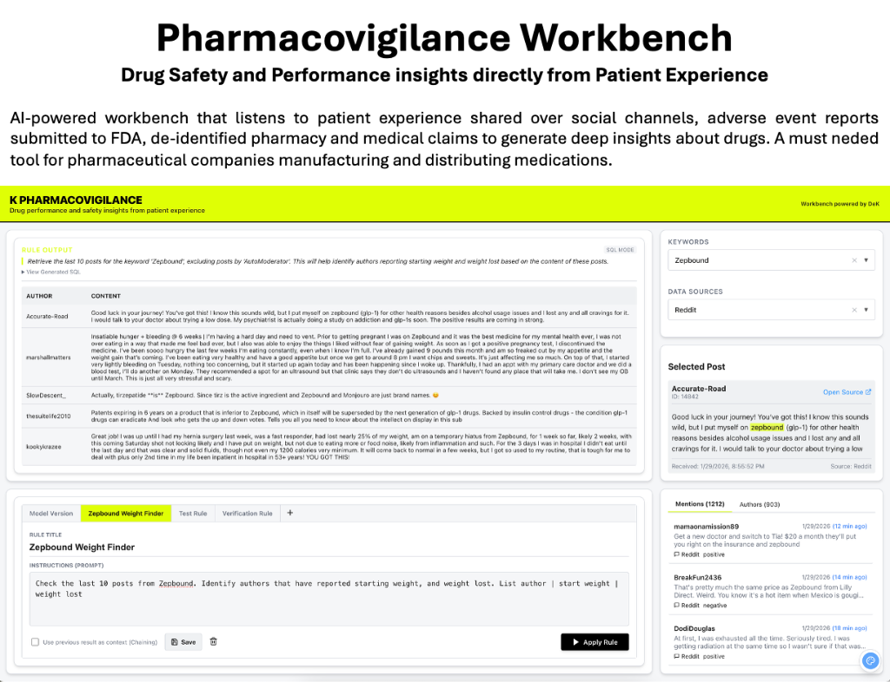

# Drug-Safety-Explorer (DXE)

Social pharmacovigilance signal exploration UI.

## Overview

DXE is a tool for Subject Matter Experts (SMEs) to explore social-reported drug experiences. It allows users to:
- Explore mentions by keyword (e.g., Zepbound)
- Analyze sentiment distribution over time
- Identify repeat authors and recurring topics
- Create and execute reproducible analysis rules

## Live Demo

[https://54-175-252-15.nip.io/](https://54-175-252-15.nip.io/)

## Technology Stack

- **Frontend**: React (Vite)
- **Backend**: Python (FastAPI)
- **Database**: PostgreSQL (RDS)
